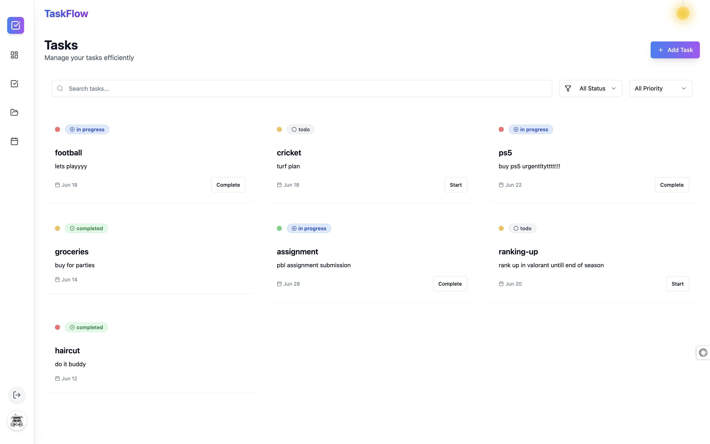

# TaskFlow

TaskFlow is a modern, intuitive task management application built with React, TypeScript, and Supabase. It provides a clean, user-friendly interface for managing your tasks, projects, and deadlines.



## Features

- ✨ Modern, responsive UI with dark mode support
- 📱 Mobile-friendly design
- 🔐 Secure authentication with Supabase
- 📊 Task management with status tracking
- 📅 Calendar integration
- 🎨 Beautiful UI components using shadcn/ui
- 🌙 Dark/Light theme support
- 🔄 Real-time updates
- 📱 Progressive Web App (PWA) support

## Tech Stack

- **Frontend:**

  - React 18
  - TypeScript
  - Vite
  - Tailwind CSS
  - shadcn/ui
  - React Router
  - React Query
  - Framer Motion

- **Backend:**
  - Supabase (Authentication & Database)
  - PostgreSQL

## Prerequisites

Before you begin, ensure you have the following installed:

- Node.js (v18 or higher)
- npm or bun
- Git

## Getting Started

1. **Clone the repository**

   ```bash
   git clone https://github.com/sush003/taskflow33.git
   cd taskflow4
   ```

2. **Install dependencies**

   ```bash
   npm install
   # or
   bun install
   ```

3. **Set up environment variables**
   Create a `.env` file in the root directory with the following variables:

   ```env
   VITE_SUPABASE_URL=your_supabase_url
   VITE_SUPABASE_ANON_KEY=your_supabase_anon_key
   ```

4. **Start the development server**

   ```bash
   npm run dev
   # or
   bun dev
   ```


## Project Structure

```
taskflow/
├── src/
│   ├── components/     # React components
│   ├── contexts/       # React contexts
│   ├── hooks/         # Custom React hooks
│   ├── integrations/  # Third-party integrations
│   ├── lib/           # Utility functions
│   ├── pages/         # Page components
│   └── types/         # TypeScript type definitions
├── public/            # Static assets
├── supabase/         # Supabase configuration and migrations
└── ...config files
```

## Available Scripts

- `npm run dev` - Start development server
- `npm run build` - Build for production
- `npm run preview` - Preview production build
- `npm run lint` - Run ESLint

## Contributing

1. Fork the repository
2. Create your feature branch (`git checkout -b feature/amazing-feature`)
3. Commit your changes (`git commit -m 'Add some amazing feature'`)
4. Push to the branch (`git push origin feature/amazing-feature`)
5. Open a Pull Request


## Acknowledgments

- [shadcn/ui](https://ui.shadcn.com/) for the beautiful UI components
- [Supabase](https://supabase.com/) for the backend infrastructure
- [Vite](https://vitejs.dev/) for the build tooling
- [Tailwind CSS](https://tailwindcss.com/) for the styling

## Support

If you encounter any issues or have questions, please [open an issue](https://github.com/sush003/taskflow33/issues) on GitHub.

---

Made with ❤️ by Sushrut Nisal
